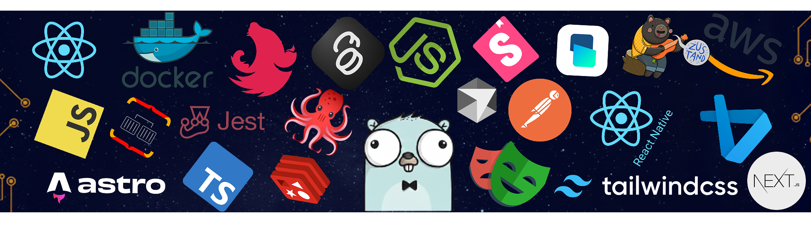

  <h1>Franklin Rodriguez</h1>
  <h3>Frontend & Product Developer</h3>
  
  

  

    
    
    
  

  

    <b>Building scalable solutions with a focus on Clean Architecture & UX.</b> 
    Currently driving product & frontend development at <b>Tudashboard</b>.
  

 

## 👨‍💻 About Me

I am a **FullStack Developer** with over **5 years of experience** specializing in the JavaScript/TypeScript ecosystem. My approach combines technical expertise with product strategy, ensuring that every line of code contributes to a robust and user-centric product.

I am a strong advocate for **Clean Code**, **SOLID principles**, and **Test-Driven Development**, believing that maintainability is key to long-term success.

---

## 🛠 Tech Stack

**Frontend & Mobile**  

**Backend & Cloud**  

**Data & Tools**  

**Testing & Quality**  

**Emerging Tech**  

